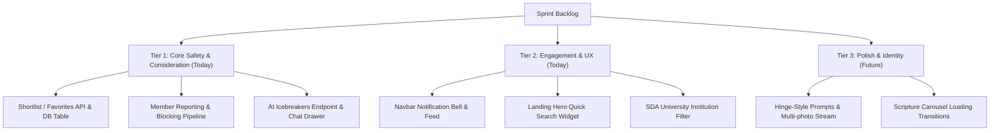

# Feature Gap Analysis: `roopeshwar06/SDA-MATRIMONY` vs. Platform Baseline

**Analysis Date:** September 19, 2026  
**Reference Repository:** [https://github.com/roopeshwar06/SDA-MATRIMONY](https://github.com/roopeshwar06/SDA-MATRIMONY)  
**Target Repository:** `MasterZ1311/SDA-Matrimony-Site`  
**Classification:** Product Architecture & Feature Enhancement Specification  

---

## 1. Executive Summary

A comprehensive, end-to-end code audit was conducted on the reference repository [`roopeshwar06/SDA-MATRIMONY`](https://github.com/roopeshwar06/SDA-MATRIMONY) across its backend (`backend/`, Express/PostgreSQL/SQLite) and frontend (`frontend/`, React 18/Vite). 

While our platform (`MasterZ1311/SDA-Matrimony-Site`) possesses a vastly superior enterprise distributed architecture (NestJS REST core, Socket.IO realtime gateway, FastAPI Python AI service with PyTorch/pgvector, 4-tier church hierarchy, tokenized pastoral endorsements, and automated PDF biodata generation), **the reference repository contains several high-value product, community-safety, and UX features that our platform currently lacks**.

This document catalogs every missing feature, analyzes their technical mechanics, and outlines recommendations for rapid integration into our current sprint.

---

## 2. Feature Comparison Matrix

| Capability / Feature Area | `roopeshwar06/SDA-MATRIMONY` | Our Current Platform | Status / Gap |
| :--- | :---: | :---: | :--- |
| **Hinge-Style Narrative Profile & Prompts** | Supported (Prompts + Likes) | Standard Form Fields | **MISSING IN OURS** |
| **Shortlist / Favorites / Bookmarks** | Supported (`/interests/shortlist`) | Not Implemented | **MISSING IN OURS** |
| **Pastoral Incident Reporting** | Supported (`/profiles/:id/report`) | Auto-moderation only | **MISSING IN OURS** |
| **Member Blocking & Search Exclusion** | Supported (`/profiles/:id/block`) | Not Implemented | **MISSING IN OURS** |
| **AI Faith-Centered Icebreaker Generator** | Supported (`/ai/icebreakers`) | Compatibility only | **MISSING IN OURS** |
| **Navbar Notification Bell & Dropdown Feed**| Supported (`/interests/notifications`) | WebSocket events only | **MISSING IN OURS** |
| **Public Landing Hero Quick-Search** | Supported (Multi-field) | Auth Browse only | **MISSING IN OURS** |
| **Devotional Rotating Scripture Loaders** | Supported (`LoadingScreen.jsx`) | Generic Spinners | **MISSING IN OURS** |
| **SDA University / Institution Filter** | Supported (Alumni Scoring) | Church Hierarchy only| **MISSING IN OURS** |
| **Dual Database Fallback (SQLite + PG)** | Supported (`db.js`) | PostgreSQL / Prisma | **DIFFERENT PATTERN** |
| **4-Tier SDA Church Hierarchy** | Generic string location | GC Divisions -> Churches | **WE ARE SUPERIOR** |
| **Tokenized Pastoral Verification Portal** | Manual Admin checkbox | Cryptographic Token Email | **WE ARE SUPERIOR** |
| **Formal Printable Biodata PDF Engine** | Not Implemented | Puppeteer/PDFKit Engine | **WE ARE SUPERIOR** |
| **Realtime WebSockets (Presence/Typing)** | HTTP Polling (4s interval) | Socket.IO + Redis Gateways | **WE ARE SUPERIOR** |
| **Computer Vision Photo Moderation** | Basic Unsplash URLs | OpenCV/PyTorch Pipeline | **WE ARE SUPERIOR** |

---

## 3. Detailed Breakdown of Missing Features

### 3.1 Hinge-Style Narrative Story Stream & Interactive Prompts
- **Reference Implementation:** `frontend/src/pages/MyProfile.jsx`, `frontend/src/components/ProfileCard.jsx`
- **What it does:** 
  Instead of a static biodata form, candidate profiles can be experienced as an interactive vertical story feed (inspired by Hinge).
- **Core Elements:**
  1. **Adventist Faith Prompts:** Predefined, faith-centric prompts that members answer:
     - *"A typical Sabbath in my life looks like..."*
     - *"The qualities I am prayerfully seeking in a spouse..."*
     - *"My favorite scripture & ministry passion..."*
     - *"Together, we could..."*
     - *"My diet & health message convictions are..."*
     - *"The best piece of spiritual advice I ever received..."*
     - *"My dream mission trip or community outreach..."*
     - *"You should leave a note on my profile if..."*
  2. **Micro-Interactions (Prompt Likes):** Direct "Like" bubbles (❤️) anchored to individual prompt answers or photo captions.
  3. **Multi-Photo Stream:** Alternating photo cards showing Sabbath nature activities, church choir, Pathfinder campouts, and wholesome fellowship.
- **Value to our platform:** Dramatically increases user engagement and conversational warmth compared to clinical database forms.

---

### 3.2 Shortlist & Favorites Subsystem ("Prayerful Consideration")
- **Reference Implementation:** `backend/routes/interests.js` (`POST /interests/shortlist`, `GET /interests/shortlist`), `schema.sql` (`favorites` table)
- **What it does:** 
  Allows members to bookmark candidate profiles before committing to sending a formal expression of interest.
- **Technical Architecture:**
  - **Database Table:**
    ```sql
    CREATE TABLE favorites (
        id SERIAL PRIMARY KEY,
        user_id INT NOT NULL REFERENCES users(id) ON DELETE CASCADE,
        target_user_id INT NOT NULL REFERENCES users(id) ON DELETE CASCADE,
        created_at TIMESTAMP WITH TIME ZONE DEFAULT CURRENT_TIMESTAMP,
        CONSTRAINT unique_user_favorite UNIQUE (user_id, target_user_id)
    );
    ```
  - **Endpoints:**
    - `POST /interests/shortlist`: Toggles bookmark state (insert on first click, delete on second click).
    - `GET /interests/shortlist`: Retrieves all saved candidate profiles with full details.
  - **Frontend UI:**
    - Star icon (⭐) floating on top-right of every profile card.
    - Dedicated "Shortlisted Profiles" tab in the Interests center.
- **Value to our platform:** Adventist courtship culture emphasizes deliberate, prayerful contemplation before initiating communication. A shortlist gives members space to reflect without notifying the other party prematurely.

---

### 3.3 Member Safety, Abuse Reporting & Pastoral Admin Queue
- **Reference Implementation:** `backend/routes/profiles.js` (`POST /profiles/:id/report`, `GET /profiles/admin/reports`), `frontend/src/components/ReportModal.jsx`
- **What it does:** 
  Provides members a safe, confidential avenue to flag suspicious accounts, fake profiles, harassment, or non-Adventist misrepresentation directly to Pastoral Administration.
- **Technical Architecture:**
  - **Database Table:**
    ```sql
    CREATE TABLE reports (
        id SERIAL PRIMARY KEY,
        reporter_id INT NOT NULL REFERENCES users(id) ON DELETE CASCADE,
        reported_user_id INT NOT NULL REFERENCES users(id) ON DELETE CASCADE,
        reason VARCHAR(255) NOT NULL,
        details TEXT,
        status VARCHAR(50) DEFAULT 'pending',
        created_at TIMESTAMP WITH TIME ZONE DEFAULT CURRENT_TIMESTAMP
    );
    ```
  - **Predefined Violation Categories:**
    1. *Inappropriate Behavior / Communication*
    2. *Fake Profile / False Identity*
    3. *Commercial Solicitation / Spam*
    4. *Non-Adventist Misrepresentation*
    5. *Harassment or Unwanted Messages*
    6. *Other Safety Concern*
  - **Pastoral Dashboard (`GET /profiles/admin/reports`):**
    Allows church elders/administrators to review incident reports alongside reporter and reported member details.
- **Value to our platform:** Elevates platform trust and institutional safety, critical for denominational governance and protecting vulnerable members.

---

### 3.4 Bi-Directional Member Blocking & Exclusion Filtering
- **Reference Implementation:** `backend/routes/profiles.js` (`POST /profiles/:id/block`), `schema.sql` (`blocked_users` table)
- **What it does:** 
  Instantly cuts off all bilateral visibility and contact between two members.
- **Technical Architecture:**
  - **Database Table:**
    ```sql
    CREATE TABLE blocked_users (
        id SERIAL PRIMARY KEY,
        user_id INT NOT NULL REFERENCES users(id) ON DELETE CASCADE,
        blocked_user_id INT NOT NULL REFERENCES users(id) ON DELETE CASCADE,
        created_at TIMESTAMP WITH TIME ZONE DEFAULT CURRENT_TIMESTAMP,
        CONSTRAINT unique_block UNIQUE (user_id, blocked_user_id)
    );
    ```
  - **Directory Search Exclusion:**
    ```sql
    WHERE u.id NOT IN (
        SELECT blocked_user_id FROM blocked_users WHERE user_id = :currentUserId
        UNION
        SELECT user_id FROM blocked_users WHERE blocked_user_id = :currentUserId
    )
    ```
  - **Communication Gates:** Prevents interest dispatch and chat message delivery if either party has blocked the other.
- **Value to our platform:** Essential privacy and boundary enforcement feature for matrimonial platforms.

---

### 3.5 Contextual AI Faith-Centered Icebreaker Generator
- **Reference Implementation:** `backend/routes/ai.js` (`POST /ai/icebreakers`), `frontend/src/pages/Chat.jsx`
- **What it does:** 
  Overcomes conversational hesitation by dynamically synthesizing spiritual, uplifting icebreakers based on the recipient's career, education, and ministry passions.
- **Sample Generated Prompts:**
  - *"Happy Sabbath! I loved reading about your passion for [occupation/ministry]. How did you feel called into that area?"*
  - *"Greetings! I noticed you are located in [location]. What is your favorite Sabbath afternoon nature spot around there?"*
  - *"What is a favorite scripture or hymn that has been blessing you recently?"*
  - *"Hello! It is a pleasure to connect. I'd love to hear more about your spiritual journey and what your ideal Sabbath looks like."*
- **Frontend Interaction:**
  Inside the active chat window, clicking "AI Icebreakers" displays a dropdown of suggestions. Clicking any starter automatically populates the text input box.
- **Value to our platform:** Replaces awkward "hi" messages with wholesome, doctrinally rich conversation starters.

---

### 3.6 Real-Time Notification Bell & Dropdown Feed
- **Reference Implementation:** `backend/routes/interests.js` (`GET /interests/notifications`), `frontend/src/components/Navbar.jsx`
- **What it does:** 
  Maintains an unread counter and persistent dropdown notification menu directly in the main top navbar.
- **Payload Structure:**
  ```json
  {
    "totalUnread": 3,
    "pendingCount": 2,
    "matchCount": 1,
    "notifications": [
      {
        "id": "prop-12",
        "type": "proposal",
        "title": "New Matrimonial Interest",
        "message": "Hannah Wright expressed interest in your profile",
        "link": "/interests",
        "date": "2026-09-19T20:00:00.000Z"
      }
    ]
  }
  ```
- **Value to our platform:** Increases member response rates to proposals and provides an intuitive notification center.

---

### 3.7 Public Hero Quick Search Widget
- **Reference Implementation:** `frontend/src/pages/Landing.jsx`
- **What it does:** 
  Enables visitors to perform high-level matchmaking queries ("Looking for Adventist Bride / Groom", "Age: 22–32", "Preferred Location") directly from the homepage hero banner, seamlessly routing them into registered browse results.
- **Value to our platform:** Major conversion driver for unauthenticated visitors landing on the site.

---

### 3.8 Devotional Rotating Scripture Loaders
- **Reference Implementation:** `frontend/src/components/LoadingScreen.jsx`
- **What it does:** 
  Instead of blank spinners, asynchronous transitions rotate inspiring biblical verses and Ellen G. White family life principles:
  - *“For I know the plans I have for you,” declares the Lord... — Jeremiah 29:11*
  - *“Two are better than one, because they have a good return for their labor.” — Eccl 4:9*
  - *"Seeking God's divine leading for your heart and future..."*
  - Visualized with a gold halo spinning ring and glowing heart emblem.
- **Value to our platform:** Enhances spiritual intentionality during state transitions.

---

### 3.9 Adventist Higher Education Institution Filter & Affinity Heuristics
- **Reference Implementation:** `backend/routes/ai.js`, `backend/routes/profiles.js`
- **What it does:** 
  Explicitly surfaces and weights Adventist collegiate heritage:
  - Institutions: Andrews University, Loma Linda University, Oakwood University, Southern Adventist University, Southwestern Adventist University, Walla Walla University, Pacific Union College, etc.
  - Generates an affinity bonus (+8%) in match compatibility when alumni of sister Adventist institutions connect.
- **Value to our platform:** Deepens cultural alignment across global Adventist alumni networks.

---

## 4. Recommended Sprint Roadmap for Integration

To absorb the best elements of the reference repository while preserving our enterprise NestJS/Next.js/FastAPI architecture, the team should prioritize implementation as follows:



### Task Assignment for 5-Person Sprint:
1. **Dev 2A (Backend - Profiles & Safety):**
   - Add `Favorite`, `Report`, and `BlockedUser` models to `packages/database/prisma/schema.prisma`.
   - Implement `POST /interests/shortlist`, `GET /interests/shortlist`.
   - Implement `POST /profiles/:id/report` and `POST /profiles/:id/block`.
2. **Dev 3 (AI Engine):**
   - Implement `POST /api/v1/compatibility/icebreakers` in FastAPI `apps/ai-engine`.
   - Add Adventist institution alumni keyword booster to `SDAMatchScoringEngine`.
3. **Dev 1 (Frontend):**
   - Add Star button to Profile Cards with shortlist toggle.
   - Build `ReportModal` component.
   - Add "AI Icebreakers" button and dropdown in the Chat conversation page.
   - Add hero search widget to the landing page.
4. **Dev 2B (Backend - Interests & Notifications):**
   - Implement `GET /interests/notifications` aggregator in `api-core`.
   - Ensure WebSocket events emit `new_report` and `shortlist_updated`.
